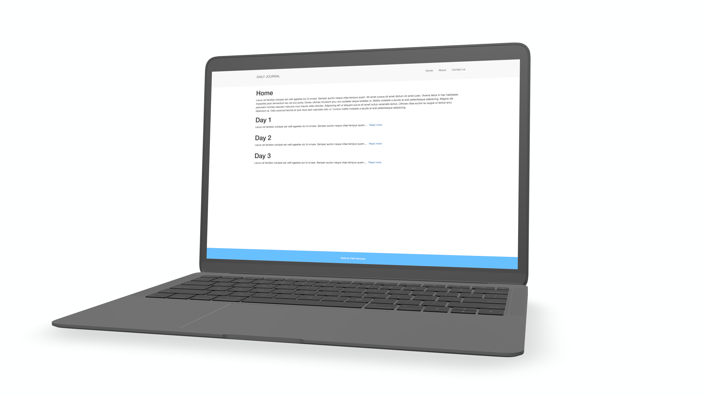

# Blogging Website #
Start your new blogging website with this template!
## Learned ##
* Routing with EJS & express.js
* Passing information from pages using express.js
* Use lodash.js for better routing
* Better use of partials for EJS
## Instructions to run ##
1. Install packages by running `npm install`
2. Add your mongoAtlas url in `mongoose.connect()`
3. Run local server by entering `nodemon app.js` || `node app.js`
4. Open `localhost:3000/`
## Different directories ##
* Home `localhost:3000/`
* Create a post `localhost:3000/compose`
* Visit recently created post `localhost:3000/posts/{postTitle}`
